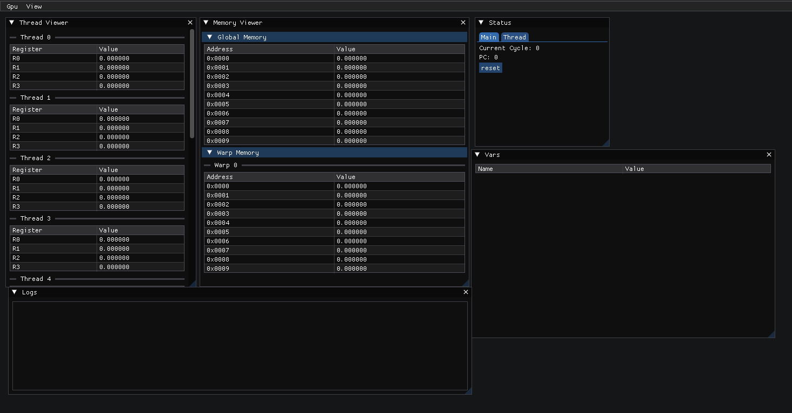

# Simulating GPU
More of an NVIDIA GPU 
REQ: imgui (just add it in the root dir)



# Syntax
The program is just a vector of type `Instr` 
```c++
using Operand = std::variant<Opcode, std::string, float, Variable, StoreLoc>;
struct Instr
{
    Opcode op;
    std::vector<Operand> src;
};
```
so just add into the vector what operations etc you want to do and insert it into the gpu and run
```c++
GPU gpu(program);
   
gpu.run();
```

It goes 
- Operation 
    - Destination
    - Source
    - Value (if required)

Once you have your program add a halt to let GPU know its the end

When you want your destination to be thread indexed you just put `TIDX` at the end of the destination 

EX 
```c++
{Opcode::ADD, {"smTIDX", "x", "z"}}
```
This stores in shared memory thread indexed.

If you want to create a variable you do 

```c++
bool ISCONSTANT = false;
bool THREADINDEXED = true;
Variable{"name", value, index, ISCONSTANT, THREADINDEXED, StoreLoc::WHEREVER}
```
if you set THREADINDEXED to true it will cancel out the index value so you can just set it to zero.

There are 3 store locations 

`StoreLoc::GLOBAL`
`StoreLoc::LOCAL`
`StoreLoc::SHARED`

GLOBAL means it will be stored in global memory

LOCAL means it will stored in register

SHARED stores in warp/shared memory

This is an example of a loop 
```c++
{Opcode::LABEL, {"LOOP",4}},
{Opcode::ADD, {"r0", "r0", 3.0f}},
{Opcode::ADD, {"i", "i", 1.0f}},
{Opcode::CMP_LT, {"i", "z"}},
{Opcode::JMP, {"LOOP"}},
```
In order to create a loop you need to have a label called whatever and then a position integer where you want the loop to return to.

Then you do whatever you need to inside of the loop

Add the conditional so in the example that is `CMP_LT` compare less than so if `i` is less than `z` continue

Finally the `JMP` which makes the program jump back to the position you set on the label. 
# Instructions
- ADD
- SUB
- MUL
- NEG 
- LD (load)
- ST (store)
- MOV 
- HALT (end of program)
- DEF (create variables)
- JMP (jump)
- CMP_LT (compare less than)

# Extra
You can print Global and Shared memory by using `print_global_mem` and `print_shared_mem` on your gpu object
```c++
gpu.print_global_mem();
gpu.print_shared_mem();
```
!Output is now directed towards the log window in the GUI!
