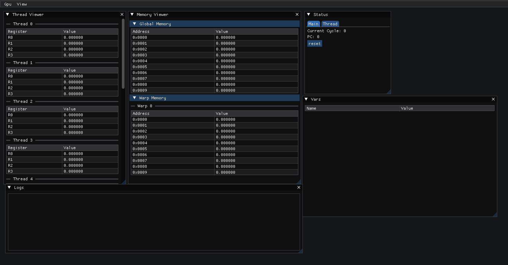

# Simulating GPU
More of an NVIDIA GPU 

REQ: imgui (just add it in the root dir)



# Syntax
The program is just a vector of type `Instr` 
```c++
using Operand = std::variant<Opcode, std::string, float, Variable, StoreLoc>;
struct Instr
{
    Opcode op;
    std::vector<Operand> src;
};
```
so just add into the vector what operations etc you want to do and insert it into the gpu and run
```c++
GPU gpu(program);
   
gpu.run();
```

It goes 
- Operation 
    - Destination
    - Source
    - Value (if required)

Once you have your program add a halt to let GPU know its the end

When you want your destination to be thread indexed you just put `TIDX` at the end of the destination 

EX 
```c++
{Opcode::ADD, {"smTIDX", "x", "z"}}
```
This stores in shared memory thread indexed.

If you want to create a variable you do 

```c++
bool ISCONSTANT = false;
bool THREADINDEXED = true;
Variable{"name", value, index, ISCONSTANT, THREADINDEXED, StoreLoc::WHEREVER}
```
if you set THREADINDEXED to true it will cancel out the index value so you can just set it to zero.

There are 3 store locations 

`StoreLoc::GLOBAL`
`StoreLoc::LOCAL`
`StoreLoc::SHARED`

GLOBAL means it will be stored in global memory

LOCAL means it will stored in register

SHARED stores in warp/shared memory

This is an example of a loop 
```c++
{Opcode::LABEL, {"LOOP",4}},
{Opcode::ADD, {"r0", "r0", 3.0f}},
{Opcode::ADD, {"i", "i", 1.0f}},
{Opcode::CMP_LT, {"i", "z"}},
{Opcode::JMP, {"LOOP"}},
```
In order to create a loop you need to have a label called whatever and then a position integer where you want the loop to return to.

Then you do whatever you need to inside of the loop

Add the conditional so in the example that is `CMP_LT` compare less than so if `i` is less than `z` continue

Finally the `JMP` which makes the program jump back to the position you set on the label. 
# Instructions
- ADD
- SUB
- MUL
- NEG 
- XOR 
- AND 
- OR
- LD (load)
- ST (store)
- MOV 
- HALT (end of program)
- DEF (create variables)
- JMP (jump)
- CMP_LT (compare less than)


# Extra
You can print Global and Shared memory by using `print_global_mem` and `print_shared_mem` on your gpu object
```c++
gpu.print_global_mem();
gpu.print_shared_mem();
```
!Output is now directed towards the log window in the GUI!

## Experimental tinygrad backend (Linux / WSL)

The local `tinygrad/` checkout supplies tinygrad; the integration is
`tinygrad/tinygrad/runtime/ops_gsim.py`. Tests explicitly select GSIM and use this
checkout, not an installed pip package. The tested checkout reports commit
`b99b9e187557a3eee7fa1f236e7f3a6c19125404` (an observed local revision, not a
new remote pin). Python 3.12 in Ubuntu/WSL was used.

Build and test from this repository root in Linux (Windows: enter with
`wsl -d Ubuntu --cd /mnt/d/gpu`):

```sh
mkdir -p .review-gsim
g++ -std=c++20 -Isrc/include -fPIC -shared -pthread \
  src/gsim_capi.cpp src/gpu.cpp src/operations.cpp src/labeltable.cpp \
  src/instruction.cpp src/vartable.cpp src/execution.cpp src/parser.cpp \
  -o .review-gsim/libgsim-python.so
PYTHONDONTWRITEBYTECODE=1 CACHELEVEL=0 DEV=GSIM \
  GSIM_LIB="$PWD/.review-gsim/libgsim-python.so" python3 test/test_gsim.py
```

The suite has 21 tests covering arithmetic, reductions/matmul, constants down to
float32 subnormals, branch selection with NaN/infinity, padding, dtype/cast and
runtime rejection contracts, changed-input program reuse, and both `NOLOCALS=0`
and `NOLOCALS=1` launches. The native headless call is synchronous and quiet;
Python does not redirect process-wide stdout.

### Supported contract

- Shaped global **float32 buffers only**. Integer and boolean intermediates are
  for indexing/comparisons, not integer/bool tensor storage. Float16/64 and
  other tensor dtypes are rejected when compiling computation.
- Integer intermediates must have provable bounds within +/-2^24; total packed
  memory and thread count are capped at 2^24 for exact float32 addressing.
- Identity casts, bounded index-int/bool to float32, and float32 to bool are
  supported. Float-to-int conversion and non-identity bitcasts are rejected.
- Static `gidx*`, `lidx*`, and no-local `idx*` axes are supported. Dynamic scalar
  parameters, buffer aliases/slices, foreign mappings, and non-default allocator
  options are not. Ordinary tensor padding lowers to guarded loads with fallback.
- This is not a general tinygrad device: unsupported UOps raise
  `NotImplementedError`; malformed runtime arguments raise `ValueError`.
  Pure copies or optimized-away expressions need not reach the renderer, so a
  successful copy alone is not evidence of dtype computation support. Discard
  tensors involved in failed realization before retrying another computation.

### Local dependency delivery

`tinygrad/` is currently a separate local git checkout and the GSIM module is
untracked inside it. Do **not** add that directory as an accidental gitlink or
commit its nested repository. To reproduce locally, obtain the same approved
checkout, verify `git -C tinygrad rev-parse HEAD`, and copy this backend module
into its `tinygrad/runtime/` directory. The test runner inserts the checkout on
`sys.path`; no global installation or pip mutation is needed.

**Unresolved PR delivery choice:** decide whether to ship tinygrad as an explicit
submodule plus a separately tracked backend overlay, vendor an approved source
snapshot, or maintain a backend patch against an agreed dependency revision.
The current working-tree integration is tested, but is not a self-contained fresh
clone dependency delivery mechanism. No guessed remote or version was pinned.
